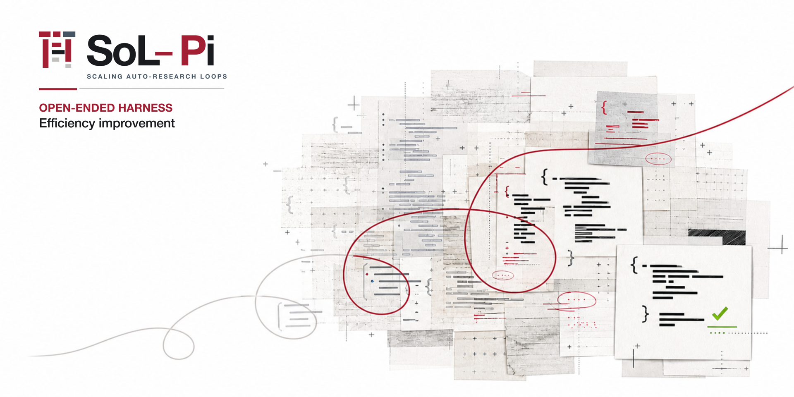

<p align="center">
  
</p>

# SoL-OMP: Scaling Auto-Research Loops for Efficient Agent Harnesses

<p align="center">
  <a href="https://arxiv.org/abs/2609.20519"></a>
  <a href="#getting-started"></a>
  <a href="docs/configuration.md"></a>
  <a href="LICENSE"></a>
</p>

> [!NOTE]
> SoL-OMP is a community-maintained native extension for [Oh My Pi (OMP)](https://github.com/can1357/oh-my-pi). It is not maintained or endorsed by NVIDIA. This fork is derived from NVIDIA Research's MIT-licensed [NVlabs/SoL-Pi](https://github.com/NVlabs/SoL-Pi); NVIDIA attribution is retained in the license and notices.

## TL;DR

**Spend less without making the agent do less useful work.**

SoL-OMP packages four opt-in efficiency mechanisms for OMP. It reduces repeated model turns, context replay, oversized observations, and unnecessary long-log reading while preserving the work and evidence an agent needs to finish a task. It uses OMP's native extension manifest and public `@oh-my-pi/*` APIs; no OMP source patch is required.

## What SoL-OMP Adds

| Area | Mechanism | What changes |
|---|---|---|
| Tools | **Action Fusion** | An edit or write can run its follow-up validation command in the same tool call. |
| Observations | **ObservationPack** | Repeated large text results become stable handles with exact paged recall. |
| Delegation | **Evidence-Preserving Reducer** | Long diagnostic logs become compact receipts only when every retained quotation matches the archived source. |
| Context | **Online Context Compact** | Completed plan steps become candidates for OMP's native compaction, subject to economic and window-pressure checks; after successful compaction, OMP continues the task in a new turn. |

The mechanisms share four rules:

- **No OMP patches.** SoL-OMP imports public OMP APIs and does not vendor the OMP source tree.
- **Explicit opt-in.** A missing configuration leaves every mechanism disabled.
- **Preserve evidence.** Original observations remain available locally, and reducer failures leave the original result unchanged.
- **Use OMP's runtime choices.** Authentication, provider URLs, the main model, and shell behavior remain under OMP's control.

## Paper and Upstream

This project is an OMP-native fork of [NVlabs/SoL-Pi](https://github.com/NVlabs/SoL-Pi), released under the MIT license. The research and original implementation are described in [SoL-Pi: Recursively Scaling Auto-Research Loops for Efficient Agent Harness](https://arxiv.org/abs/2609.20519). See [THIRD_PARTY_NOTICES.md](THIRD_PARTY_NOTICES.md) for retained attribution.

## Getting Started

### Requirements

- Node.js 22.19 or newer
- OMP 18.2.6

Install the tested OMP release if it is not already available. Follow the
[official OMP installation instructions](https://github.com/can1357/oh-my-pi);
the resulting `omp --version` must report `18.2.6`.

### Install

Replace `<your-github-username>` with the GitHub owner of the SoL-OMP repository you intend to trust, then install it through OMP's plugin manager:

```bash
omp plugin install git:github.com/<your-github-username>/SoL-OMP
```

The package is named `sol-omp` and exposes `./src/sol-omp/index.ts` through the `omp.extensions` manifest field. Restart OMP after installation so it loads the extension.

### Configure

SoL-OMP reads one effective `sol-omp.json` file, in this order:

1. `<project>/.omp/sol-omp.json`, when OMP trusts the project and the file exists;
2. `<OMP agent directory>/sol-omp.json`, normally the user-wide OMP agent directory;
3. built-in defaults when neither file exists.

The project file replaces the user file; the two are not merged. Every feature defaults to `false`. For example, this conservative project configuration enables the two local mechanisms that make no additional model calls:

```bash
mkdir -p .omp
cat > .omp/sol-omp.json <<'JSON'
{
  "version": 1,
  "actionFusion": true,
  "observationPack": true,
  "evidencePreservingReducer": false,
  "onlineContextCompact": false,
  "cacheWriteReadRatio": 12.5
}
JSON
```

To configure all four mechanisms, start from [sol-omp.example.json](sol-omp.example.json), enable the additional flags, and select the reducer provider/model if needed. Never put credentials in this file: the reducer uses OMP-managed authentication. See [Configuration](docs/configuration.md) for the complete schema and trust behavior.

## Storage and Security

ObservationPack and Evidence-Preserving Reducer store session-specific archives under:

```text
<OMP session directory>/sol-omp/<session-id>/
├── observation-pack/
└── evidence-preserving-reducer/
```

Archived copies remain local and are not automatically deleted when an OMP session ends. Online Context Compact stores state in OMP's session log. Evidence-Preserving Reducer may send eligible diagnostic-log content to its configured reducer model using OMP-managed authentication. Review [SECURITY.md](SECURITY.md) before enabling it; do not enable remote reduction for logs that must remain local.

## Documentation

| Document | Purpose |
|---|---|
| [Configuration](docs/configuration.md) | Config search order, schema, defaults, and trust behavior |
| [Compatibility](docs/compatibility.md) | OMP 18.2.6 support and native extension integration |
| [Security](SECURITY.md) | Local storage, remote reduction, and sensitive behavior |
| [Agent installation](agents-install.md) | Reproducible installation and all-enabled validation procedure |

## Development

Install from the lockfile and run the repository checks:

```bash
bun install --frozen-lockfile --ignore-scripts
bun run check
bun audit --audit-level=high
bun scripts/check-sol-omp-compat.mjs
```

The development dependencies are pinned to OMP 18.2.6. Runtime `@oh-my-pi/*` packages remain peer dependencies so OMP owns their installation and upgrades.

## Project Status

SoL-OMP is a community-maintained OMP port derived from NVlabs/SoL-Pi. NVIDIA Research created and released the upstream project under the MIT license, but NVIDIA does not maintain or endorse this fork.

Contributions should target OMP's public extension APIs and preserve the evidence and opt-in guarantees described above. See [CONTRIBUTING.md](CONTRIBUTING.md).

## License

SoL-OMP is distributed under the [MIT License](LICENSE), with upstream NVIDIA copyright and attribution retained.
